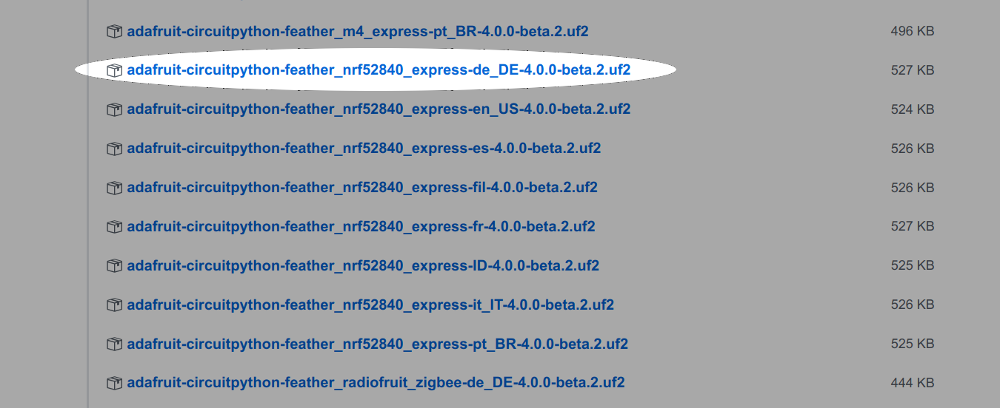

### Überblick

Vielleicht hältst du gerade eine kleine Platine in den Händen und weiß nicht so recht, was du damit anfangen sollst. Vielleicht hast du sie schon mal an deinen Computer angeschlossen und vielleicht wurde sie sogar schon als Laufwerk mit dem Namen CIRCUITPY angezeigt. Vielleicht aber auch nicht. Auf alle Fälle ist eines aber sicher: Du bist hier, weil du wissen möchtest, wie es weiter geht und was du mit deiner Mikrocontroller-Platine alles anfangen kannst.

**Dieser Kurs möchte dir zeigen, wie du mit CircuitPython loslegen und tolle Dinge erschaffen kannst!**

Es gibt unvorstellbar viele Möglichkeiten, was du mit deinem neuen Board anfangen kannst. Auf alle Fälle wirst du dazu eine neue Programmiersprache lernen dürfen. Sehr wahrscheinlich hast du noch nie etwas von Circuitpython gehört. Das macht nichts den hier lernst du alles, was du brauchst um gleich mit dem Programmieren los legen zu können.

"Aber ich habe noch nie in meinem Leben programmiert. Das lerne ich niemals!" Ganz im Gegenteil! Dank CircuitPython wirst du sehr rasch lernen, wie einfach Programmieren sein kann und wie viel Spaß man damit haben kann. Wenn das für dich alles Neuland ist, bist du hier genau richtig!

In diesem Kurs erfährst du, wie du mit CircuitPython loslegst. Vorher erfährst du, wie du CircuitPython installierst, wie du es auf die neueste Version aktualisieren kannst, wie du eine serielle Verbindung einrichtest und wie du die Dateien auf deinem Board bearbeitest.

Willkommen in der CircuitPython-Welt!

### Was ist Circuitpython?

CircuitPython ist eine Programmiersprache, die das Experimentieren und Erlernen des Programmierens auf kostengünstigen Mikrocontroller-Boards vereinfacht. Der Einstieg in die Mikrocontrollerprogrammierung wird einfacher als je zuvor.
Zum ersten Mal ist es möglich Programme direkt auf dem Mikrocontroller zu bearbeiten und das ohne das dazu eine spezielle Desktop-App installiert werden muss. Wenn dein Board eingerichtet ist, öffnest du einen beliebigen Texteditor und beginnst einfach mit der Bearbeitung deines Programmcodes.

CircuitPython basiert auf Python. Python ist die am schnellsten wachsende Programmiersprache. Sie wird an Schulen und an Universitäten gelehrt. Dabei handelt sich um eine Programmiersprache, die einfacher zu lesen, zu schreiben und zu warten ist (als beispielsweise C oder C++). Module und Pakete ermöglichen es dir, dass du deinen Code problemlos für andere Projekte wiederverwenden kannst. Python hat einen eingebauten Interpreter, was bedeutet, dass es keine zusätzlichen Schritte wie das Kompilieren gibt, um deinen Code zum Laufen zu bringen. Und natürlich ist Python Open Source Software, das heißt, es ist jedem frei, Python zu nutzen, zu modifizieren oder zu verbessern.

CircuitPython erweitert den gewaltigen Funktionsumfang von Python um die Hardwareunterstützung für solche Boards wie das, dass du möglicherweise gerade in den Händen hältst. Wenn du bereits über Python-Kenntnisse verfügst, wirst du diese leicht auf CircuitPython anwenden können. Wenn du noch keine Erfahrung hast, wist du ganz einfach loslegen können! Wir werden bei Null anfangen.

Warum sollte ich CircuitPython verwenden?
CircuitPython kann auf Mikrocontroller-Boards ausgeführt werden. Eine Mikrocontrollerplatine ist eine Platine mit einem Mikrocontrollerchip, der im Wesentlichen ein recht kleiner All-in-One-Computer ist. Das Board, das Sie in der Hand halten, ist ein Mikrocontroller-Board!

Gründe, die für die Verwendung von CircuitPython sprechen:

* **Du willst ohne komplizierte Installationen schnell und einfach loslegen.** Erstelle eine Datei, bearbeite Sie, speichere Sie ab und das Programm wird sofort ausgeführt. Kein Kompilieren, kein Download und kein Upload ist mehr nötig.

* **Du willst das Programmieren lernen.** CircuitPython war von Anfang an auf den Bildungsbereich ausgerichtet. Es ist einfach, mit dem Programmieren zu beginnen, und du erhältst sofort ein Feedback von deinem Board. Fehlersuche war noch nie so einfach.

* **Aktualisieren deinen Code so einfach wie nie.** Da sich dein Code auf dem Laufwerk befindet, kannst du ihn jederzeit bearbeiten. Du kannst natürlich auch gleich mehrere unterschiedliche Programme auf dem Board abspeichern und beim Experimentieren entscheidest du, welches du ausführen möchtest.

* **Die serielle Konsole und der REPL** ermöglichen ein Live-Feedback aus deinem Code und eine interaktive Programmierung.

* **Dateispeicher.** Der interne Speicher für CircuitPython eignet sich hervorragend für das Loggen von Messwerten und anderen Daten sowie für die Wiedergabe von Audioclips und jede anderweitige Interaktion mit Dateien.

* **Sehr umfangreiche Hardware-Unterstützung.** Es gibt viele Bibliotheken und Treiber für Sensoren, Breakout-Boards und andere externe Komponenten.

* **Es ist Python!** Python ist die, zu Zeit am schnellsten wachsende Programmiersprache. Aufgrund ihrer leicht verständlichen Syntax wird sie gerne an Schulen und Universitäten gelehrt. CircuitPython ist fast vollständig mit Python kompatibel. Es wurde einfach eine Hardwareunterstützung für unterschiedliche Chips hinzugefügt.

CircuitPython entwickelt sich ständig weiter und wird ständig aktualisiert. Jeder kann dabei mit helfen und Verbesserungsvorschläge machen oder sich sogar selbst am Entwicklungsprozess beteiligen. Es gibt auch einen Discord-Kanal, in dem einem geholfen wird wenn man ein Problem hat. Man sollte sein Anliegen aber in englischer Sprache verfassen, da Circuitpython von Menschen auf der ganzen Welt entwickelt wird und jeder Mensch wenigstens ein bischen Englisch verstehen sollte.

### CircuitPython installieren

Die Chancen stehen gut, dass du diesen Teil einfach überspringen kannst, denn auf den meisten CircuitPython-kompatiblen Boards ist bereits CircuitPython installiert. 
Andere sind nur CircuitPython-ready und CircuitPython muss zunächst installiert werden. 
Sehr wahrscheinlich willst du aber die auf deinem Board bereits installierte Version von CircuitPython aktualisieren. Die Schritte für die Installation und Aktualisierung sind identisch.
Frage im Zweifel unbedingt zu erst die Person, von der du das Board bekommen hast!

Hier erfährst du, wie du CircuitPython auf den Board installierst bzw. aktualisierst. Du musst CircuitPython nur ein einziges Mal installieren. Wenn du die folgenden Schritte durchlaufen hast, kannst du mit dem Programmieren sofort los legen. Von Zeit zu Zeit empfiehlt es sich aber das Board auf die neuste Version zu aktualisieren. Der Weg ist der gleiche.

#### Lade die letzte Version herunten

*In diesem Kurs verwenden wir die Version 4 von Circuitpython*

Als erstes solltest du dir die neueste Version von CircuitPython 4 herunterladen.

Achtung: Sichere bitte vor jedem Update deine Programme. In der Regel wird während des Updates nichts von dem Laufwerk entfernt, aber es kann auch mal was schief gehen. Wenn du also bereits Code auf deinem Board gespeichert hast, sichere ihn auf deinem Computer, bevor du die folgenden Schritte ausführst.

[Downloadlink](https://github.com/adafruit/circuitpython/releases/)

Blättere in der Liste nach unten und wähle die, für dein Board geeignete Datei aus. Jede Datei enthält den Namen des Boards, mit der sie kompatibel ist. Lade die, zu deinem Board passende Datei herunter.

Schließe als nächstes dein Board mit einem USB-Datenkabel an deinen Computer an. Das USB-Kabel muss ein Datenkabel sein! Es gibt auch Kabel, die nur zum Aufladen geeignet sind. Unter Windows 7 waren zusätzlich noch Treiber zu installieren. Unter Mac OS sowie unter Linux und ab Windows 10 brauchst du dir darüber keine Sorgen mehr zu machen.

#### Starten den UF2-Bootloader

todo

#### Den MU Editor installieren

### Hardware vorbereiten

#### Circuitpython updaten

### Aufbau des Unterrichts

### Weitere Informationen

#### Links zu englischsprachigen Anleitungen

* [welcome-to-circuitpython](https://learn.adafruit.com/welcome-to-circuitpython)
* [circuitpython-built-ins](https://learn.adafruit.com/adafruit-circuit-playground-express/circuitpython-built-ins)
* [circuitpython-essentials](https://learn.adafruit.com/circuitpython-essentials/circuitpython-essentials)
* [adafruit-feather-m4-express-atsamd51](https://learn.adafruit.com/adafruit-feather-m4-express-atsamd51/overview)
* [circuitpython-digital-inputs-and-outputs](https://learn.adafruit.com/circuitpython-digital-inputs-and-outputs/)
* [circuitpython-basics-i2c-and-spi](https://learn.adafruit.com/circuitpython-basics-i2c-and-spi/i2c-devices)

#####Projekte
* [circuitpython-servo-tester](https://learn.adafruit.com/circuitpython-servo-tester)
* [how-tall-is-it](https://learn.adafruit.com/how-tall-is-it/example-a-tree)
* [adafruit-io-home-security](https://learn.adafruit.com/adafruit-io-home-security)
